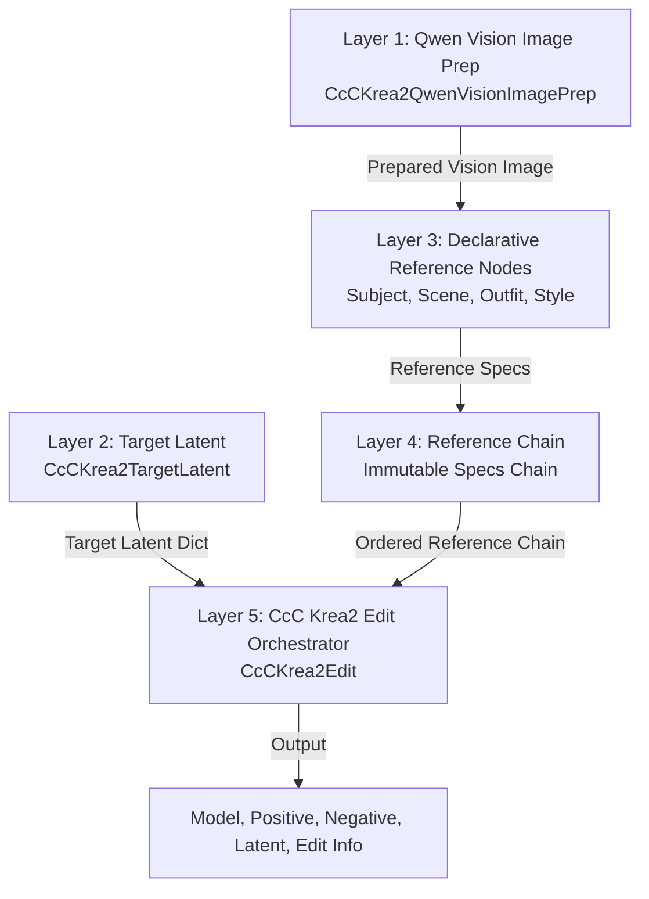

# CcC Krea2 Technical Architecture and Workflow Strategy

This document provides a comprehensive technical breakdown of the 5-layer modular architecture implemented in `ComfyUI-CcC-Krea2`. It details image representation models, slot-resolution logic, conditioning pipelines, geometry calculations, and practical workflow strategies for production deployment.

---

## 1. Goals and Design Principles

1. **Strict Upstream Parity**: Match upstream `ComfyUI-Krea2Edit` and `ComfyUI-Krea2Moodboard` behavior, formulas, and geometry down to floor division (`// 16`) and tile shuffle orders.
2. **Modular 5-Layer Composition**: Replace single monolithic nodes with decoupled, composable layers: Vision Preparation, Target Latent, Declarative References, Immutable Chain, and Edit Orchestrator.
3. **Dual Image Paths**: Maintain clean separation between Qwen Vision semantic images (`vision_image`) and VAE reference latents (`vae_reference_latent`).
4. **Deterministic Physical Alignment**: Resolve logical reference slots into consecutive physical Qwen image indices and VAE reference frame numbers with non-Style references preceding Style.

---

## 2. Five-Layer Modular Architecture

---

## 3. The Three Image Representations

In this architecture, an input image exists in up to three distinct representations:

1. **`original_image`**: The raw pixel tensor (`[B, H, W, C]`) provided by the user. Kept intact for VAE crop/fit processing.
2. **`vision_image`**: The semantic derivative prepared by Layer 1 (`CcCKrea2QwenVisionImagePrep`) aligned to Qwen patch factor (`16 * 2 = 32`). Used exclusively for Qwen3-VL tokenization and attention context.
3. **`vae_reference_latent`**: The fitted pixel image cropped, scaled, and encoded via VAE into spatial reference latents (`[B, C, H//8, W//8]`). Used for spatial attention patching in the diffusion model.

---

## 4. Independent Semantic Image Sizing

Semantic vision sizing (`vision_image`) is strictly independent of VAE latent sizing (`vae_reference_latent`):

- **Native Mode**: Computes exact Qwen2-VL / Qwen3-VL native aspect-ratio grid geometry adhering to `min_pixels` (3,136) and `max_pixels` (12,845,056). Resizes using native bilinear interpolation.
- **Adaptive Mode**: Resizes within user-configured minimum and maximum megapixels while retaining source aspect ratio.
- **Fixed Mode**: Standardizes vision inputs to a specific fixed megapixel resolution regardless of source dimensions.

---

## 5. Target Latent: Content versus Geometry

`CcCKrea2TargetLatent` separates **Target Latent Geometry** (output pixel height `H` and width `W`) from **Latent Content Source** (`empty`, `subject`, `scene`, `source`).

- **Target Geometry**: Derived from `output_resolution` (`subject`, `scene`, `source`, `custom`, `fixed`) or manual aspect inputs.
- **Latent Content**: Decoupled initialization. An empty latent can inherit geometry from the `scene` reference while creating a fresh blank latent (`empty`).

---

## 6. Complete Target Latent Combination Matrix

The 9 primary Target Latent combinations across Latent Source and Output Resolution:

| Combination | Latent Source | Output Resolution | Description | Primary Use Case |
|---|---|---|---|---|
| 1 | `empty` | `subject` | Blank latent; size matches Subject reference | New character generation in Subject aspect |
| 2 | `empty` | `scene` | Blank latent; size matches Scene reference | Character placement into existing Scene bounds |
| 3 | `empty` | `fixed` | Blank latent; size set by fixed MP / custom aspect | Standard banner / wallpaper generation |
| 4 | `subject` | `subject` | Inpaint/edit Subject image at its native aspect | Direct Subject retouching or outfit swapping |
| 5 | `subject` | `scene` | Inpaint/edit Subject image fitted into Scene aspect | Subject modification with Scene aspect constraints |
| 6 | `subject` | `fixed` | Inpaint/edit Subject image fitted to fixed dimensions | Format conversion of Subject edit |
| 7 | `scene` | `subject` | Inpaint/edit Scene image fitted into Subject aspect | Scene restyling forced to Subject aspect |
| 8 | `scene` | `scene` | Inpaint/edit Scene image at its native aspect | Direct background expansion or scene editing |
| 9 | `scene` | `fixed` | Inpaint/edit Scene image fitted to fixed dimensions | Scene modification for specific output aspect |

---

## 7. Practical Workflow Strategies

| Strategy Goal | Latent Source | Output Resolution | Active Reference Roles | Recommended Settings |
|---|---|---|---|---|
| **Max Identity Preservation** | `empty` | `subject` | Subject (Slot 1) | `pose_anchor`: 0.8, `outfit_anchor`: 0.6, `masked_identity_anchor`: 1.0 |
| **Subject Replacement** | `scene` | `scene` | Scene (Slot 1), Subject (Slot 2) | Latent Source = `scene`, Inpaint mask over original character |
| **Identity-Priority Placement**| `empty` | `scene` | Subject (Slot 1), Scene (Slot 2) | Enforce Subject as Slot 1 for maximum identity attention |
| **New Pose Generation** | `empty` | `subject` | Subject (Slot 1) | `pose_anchor`: 0.0, `outfit_anchor`: 0.5 |
| **Fine Outfit Replacement** | `subject` | `subject` | Subject (Slot 1), Outfit (Slot 2) | Outfit reference active; exclude wearer face/body |
| **Preserve Scene Lighting** | `empty` | `scene` | Scene (Slot 1), Subject (Slot 2) | `scene_anchor`: 0.9, Scene fit = `auto` |
| **Fixed Delivery Format** | `empty` | `fixed` | Subject, Scene, Style | `output_resolution` = `fixed`, `megapixels` = 1.0 |

---

## 8. Visual Reference Fit Options

- **`auto`**: Evaluates source vs target dimensions. If dimensions match or source is slightly larger (discarded area $\le 10\%$, dimensions within $5\%$), selects `crop_only`. If coverage $\ge 92\%$, selects `crop_and_resize`. Otherwise, selects `fit`.
- **`fit`**: Enforces strict aspect-ratio fit without crop optimization. Output dimensions are floored via `(int(src * scale) // 16) * 16`.
- **`crop`**: Performs minimal center crop to match target aspect ratio, then resizes to exact target grid dimensions.

---

## 9. Reference Roles

- **Subject**: Provides identity, facial features, body structure, and person appearance.
- **Scene**: Provides composition, background, environment, lighting, and camera framing.
- **Outfit**: Provides clothing, garments, and accessories without wearer identity or background.
- **Style**: Provides color palette, lighting, texture, and rendering style. Does not participate in VAE spatial reference path or negative conditioning.

---

## 10. Logical Slots, Physical Images, and VAE Frames

- **Logical Slots**: User-assigned or auto-numbered 1..N indices for reference ordering.
- **Physical Qwen Images**: One-based physical index of vision images passed to Qwen token stream. Non-Style references map 1:1; Style references expand to 1 (full), 4 (2x2), or 16 (4x4) physical Qwen images.
- **VAE Reference Frames**: One-based frame index assigned strictly to VAE spatial reference latents (Subject, Scene, Outfit). Style references have VAE Reference Frame = `none`.

---

## 11. Attention Boost versus Anchor

- **Attention Boost**: Scales cross-attention gain in diffusion UNet/Transformer layers for spatial latents.
- **Anchor**: Text directive weights appended to Qwen system/user prompts (e.g., `Anchor the subject pose with weight 0.80.`).

---

## 12. Moodboard Style Processing

1. **Fidelity Transformation**:
   $$z_{\text{out}} = \text{fidelity} \cdot z_{\text{orig}} + (1.0 - \text{fidelity}) \cdot z_{\text{target}}$$
   where $z_{\text{target}}$ is constructed by cycling mean, mean + std, and mean - std computed across visual rows.
2. **Indirect Style Transfer**:
   Designated indirect style visual rows are removed in **one operation** using a consolidated boolean keep-mask. Associated `attention_mask` metadata is sliced `[..., keep]` to ensure sequence length alignment.

---

## 13. Positive and Negative Conditioning

- **Positive Qwen Context**: Includes Subject, Scene, Outfit, expanded Style images/directives, Global Vision Directive, positive prompt, and prompt augmentation.
- **Negative Qwen Context**: Includes Subject, Scene, Outfit, Global Vision Directive, negative prompt, and negative prompt augmentation. **Strictly excludes all Style images, crops/tiles, Style automatic directives, and Moodboard operations.**

---

## 14. Execution Sequence (22 Steps)

1. Inspect Target Latent dimensions.
2. Resolve logical reference slots, aliases, VAE frames, and physical Qwen ranges.
3. Validate reference order (non-Style before Style).
4. Layer prompt augmentations.
5. Build automatic role text directives using physical Qwen image ranges.
6. Build positive role directive block.
7. Build negative role directive block.
8. Resolve visual reference fit geometry for non-Style references.
9. Crop and resize VAE reference images and masks in lockstep.
10. VAE encode spatial reference latents.
11. Build VAE reference specifications list.
12. Build positive Qwen physical images list.
13. Build negative Qwen physical images list.
14. Expand Style references into crops/tiles (full, 2x2, 4x4).
15. Append Style crops to positive Qwen physical images list.
16. Tokenize and encode positive Qwen context with dynamic template.
17. Tokenize and encode negative Qwen context with dynamic template.
18. Extract Qwen vision row spans via real token dictionary `elem["data"]` and encoder geometry.
19. Perform Moodboard Style Fidelity statistical transformation on positive conditioning.
20. Perform single-pass indirect Style row deletion and repair attention mask.
21. Patch diffusion model spatial attention hooks.
22. Format comprehensive `edit_info` pipeline execution report.

---

## 15. Limitations and Non-Guarantees

- **No Global Model Patching**: Model hooks are restricted strictly to reference conditioning calls.
- **Qwen Stream Coupling**: Vision span extraction relies on ComfyUI Qwen token-pair structure (`qwen3vl_4b`, `qwen_vl`, `qwen3vl`).
- **Style Spatial Exclusion**: Style references do not provide spatial VAE reference latents.

---

## 16. Upstream Parity and Attribution

- Ported from and attributed to `ComfyUI-Krea2Edit` by lbouaraba (GPL-3.0 / MIT) and `ComfyUI-Krea2Moodboard`.
