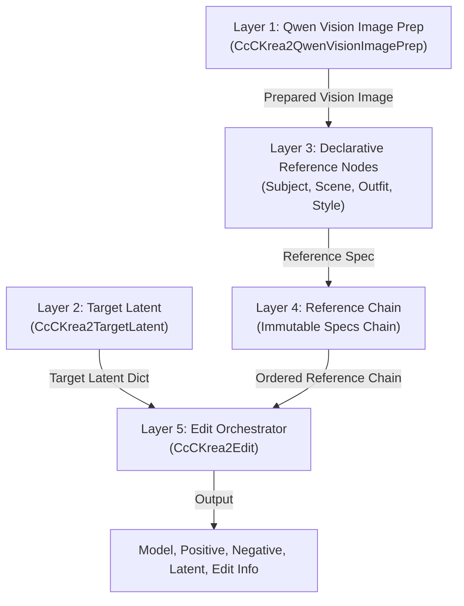

# CcC Krea2 Technical Architecture and Workflow Strategy

This document provides the canonical technical architecture and workflow strategy for `ComfyUI-CcC-Krea2`. It details the 5-layer modular pipeline, image representation models, Target Latent combinations, reference order resolution, and practical workflow strategies for production deployment.

---

## 1. Goals and Design Principles

1. **Strict Upstream Parity**: Reproduce upstream `ComfyUI-Krea2Edit` (commit `5f8a02c`) and `ComfyUI-Krea2Moodboard` (commit `a7d83f1`) algorithms, mathematical definitions, and pixel-space geometry down to integer floor division (`// 16`), crop rounding (`round()`), and tile shuffle orders.
2. **Modular 5-Layer Pipeline**: Decouple image prep, target latent creation, declarative reference definitions, immutable chain ordering, and edit orchestration into dedicated, composable nodes.
3. **Triple Image Representations**: Explicitly separate raw source images, Qwen Vision semantic images (`vision_image`), and spatial VAE reference latents (`vae_reference_latent`).
4. **Deterministic Reference Ordering**: Single-source slot resolution ensuring all non-Style references precede Style references in physical token streams and VAE spatial frames.

---

## 2. Five-Layer Modular Architecture

- **Layer 1 (Qwen Vision Image Prep)**: Resizes raw image into a Qwen-optimized derivative (`vision_image`) aligned to patch boundaries (`32x32`), while retaining the original pixel tensor for VAE processing.
- **Layer 2 (Target Latent)**: Resolves the target latent tensor (`[B, 16, H//8, W//8]`), independently configuring Latent Content Source (`Empty`, `Subject`, `Scene`) and Target Geometry (`Favor Subject`, `Favor Scene`, `Fixed`).
- **Layer 3 (Declarative References)**: Defines per-reference specs (`Subject`, `Scene`, `Outfit`, `Style`), configuring visual fit modes (`Auto`, `Fit`, `Crop`), attention boosts, masks, and style processing mode.
- **Layer 4 (Reference Chain)**: Maintains an immutable linked chain of reference specifications (`PREPARED_REFERENCE_CHAIN`).
- **Layer 5 (Edit Orchestrator)**: Consumes the reference chain, resolves physical Qwen indices and VAE frame numbers, executes Qwen text/vision encoding, applies Moodboard statistical transforms, patches diffusion model attention hooks, and formats `edit_info`.

---

## 3. The Three Image Representations

In this architecture, an input image exists in up to three distinct representations:

1. **Original Image**: The unmodified raw pixel tensor (`[B, H, W, C]`) provided by the user. Preserved intact for VAE reference crop/fit processing in Layer 5.
2. **Vision Image**: The semantic derivative prepared by Layer 1 (`CcCKrea2QwenVisionImagePrep`) aligned to Qwen patch factor (`16 * 2 = 32`). Used exclusively for Qwen3-VL tokenization and visual context.
3. **VAE Reference Latent**: The fitted pixel image cropped, scaled, and encoded via VAE into spatial reference latents (`[B, 16, H//8, W//8]`). Used for spatial cross-attention patching in the diffusion model.

> [!NOTE]
> `CcCKrea2QwenVisionImagePrep` does **not** perform grounding itself. Grounding occurs when Qwen processes prepared images, aliases, automatic role directives, Extra Vision Directives, Global Vision Directives, and positive or negative prompts during orchestration in Layer 5.

---

## 4. Independent Semantic Image Sizing

Semantic vision image sizing (`vision_image`) is strictly independent of VAE latent output sizing (`vae_reference_latent`):

- **Native Mode**: Computes exact Qwen2-VL / Qwen3-VL native aspect-ratio grid geometry adhering to `min_pixels` (3,136) and `max_pixels` (12,845,056).
- **Adaptive Mode**: Resizes within user-configured minimum (`min_mp`) and maximum (`max_mp`) megapixels while retaining source aspect ratio.
- **Fixed Mode**: Standardizes vision inputs to a specific fixed megapixel resolution (`fixed_mp`) regardless of source dimensions.

> [!IMPORTANT]
> Semantic image size and output image size are completely decoupled. A higher semantic megapixel setting may improve small-detail Qwen understanding, but it does **not** automatically improve VAE identity preservation or increase VAE latent output resolution.

---

## 5. Target Latent: Content versus Geometry

`CcCKrea2TargetLatent` separates **Target Latent Content** from **Target Geometry**:

- **Target Latent Content**: `Empty` (zeros tensor), `Subject` (VAE-encoded Subject image), or `Scene` (VAE-encoded Scene image).
- **Target Geometry**: `Favor Subject` (dimensions derived from Subject reference), `Favor Scene` (dimensions derived from Scene reference), or `Fixed` (dimensions derived from fixed megapixel / aspect ratio selection).

---

## 6. Complete Target Latent Combination Matrix

The 9 primary Target Latent combinations across Content and Geometry:

| Combination | Content | Geometry | Main Objective | Expected Tendency | Trade-offs | Typical Use Case |
|---|---|---|---|---|---|---|
| 1 | `Empty` | `Favor Subject` | Free generation from noise in Subject aspect | Flexible pose/environment; uses Subject aspect ratio | Requires identity attention guidance without initial Subject pixels | Character generation in new poses or environments |
| 2 | `Empty` | `Favor Scene` | Free generation from noise in Scene aspect | Flexible composition in Scene dimensions | No direct pixel initialization from Scene | Character placement into fresh Scene-proportioned layout |
| 3 | `Empty` | `Fixed` | Free generation at fixed dimensions | Exact target width/height (e.g. 16:9 banner) | Subject/Scene aspect ratio must be adapted to target | Standard T2I banner/wallpaper generation |
| 4 | `Subject` | `Favor Subject` | Max identity continuity & subtle adjustment | Strongest pixel preservation of Subject | Limited composition changes; stays close to original Subject | Direct Subject retouching, face touchup, subtle edits |
| 5 | `Subject` | `Favor Scene` | Subject pixel edit inside Scene aspect | Subject pixels adapted to Scene aspect ratio | Subject spatial distortion if aspect ratios differ significantly | Subject editing within wide aspect constraints |
| 6 | `Subject` | `Fixed` | Subject pixel edit at fixed dimensions | Exact target output resolution initialized with Subject | May require crop/fit of Subject base pixels | Fixed-format delivery of Subject modifications |
| 7 | `Scene` | `Favor Subject` | Scene pixel edit fitted to Subject aspect | Scene background initialized; forced into tall Subject aspect | Scene cropping on left/right edges | Restyling Scene into vertical portrait layout |
| 8 | `Scene` | `Favor Scene` | Scene pixel edit in native Scene aspect | Strongest pixel preservation of Scene background | Subject must be inserted into existing Scene pixels | Subject insertion or localized scene inpainting |
| 9 | `Scene` | `Fixed` | Scene pixel edit at fixed dimensions | Scene background initialized at exact target resolution | Scene pixels scaled/cropped to fit target MP | Fixed-format delivery of Scene edits |

---

## 7. Practical Workflow Strategies

### 7.1 Maximum Identity Continuity / Subtle Adjustment
- **Target Content**: `Subject`
- **Target Geometry**: `Favor Subject`
- **Active References**: Subject reference (Slot 1)
- **Subject Fit**: `Auto`
- **Prompt**: Requests limited change
- **Optional**: Face mask and higher Subject Attention Boost (`1.2` - `1.5`)
- **Rationale**: Initializing the latent directly from Subject pixels and matching target geometry to the Subject reference minimizes geometric adaptation and preserves fine identity details.

### 7.2 Freer Generation / New Pose / Environment
- **Target Content**: `Empty`
- **Target Geometry**: `Favor Subject`
- **Active References**: Subject reference (Slot 1)
- **Rationale**: Generating from noise allows the diffusion model to generate new poses and environments while maintaining Subject-friendly aspect ratio constraints. Identity guidance is provided via Qwen vision tokens and spatial VAE reference latents.

### 7.3 Subject Replacement in an Existing Scene
- **Target Content**: `Scene`
- **Target Geometry**: `Favor Scene`
- **Active References**: Scene reference (Slot 1), Subject reference (Slot 2)
- **Masking**: Inpaint mask applied over original character in Scene image
- **Rationale**: Retains background pixels while inserting new Subject identity into the masked region.

### 7.4 Identity-Priority Placement into a Scene
- **Target Content**: `Scene` or `Empty`
- **Target Geometry**: `Favor Subject`
- **Active References**: Scene reference (Slot 1), Subject reference (Slot 2)
- **Order Note**: Always maintain `Scene` as Slot 1 and `Subject` as Slot 2 to satisfy Edit LoRA training expectations.
- **Rationale**: Priority for identity comes from setting Target Geometry to `Favor Subject`, raising Subject Attention Boost, applying identity anchors, and prompt conditioning—**not** from reversing reference slot order.

### 7.5 Fine Outfit Replacement
- **Target Content**: `Subject`
- **Target Geometry**: `Favor Subject`
- **Active References**: Subject reference (Slot 1), Outfit reference (Slot 2)
- **Anchors**: `subject_outfit_anchor` = `0.0`, `outfit_anchor` = `0.8` (Note: anchors modulate Qwen text directives only).

### 7.6 Scene-Preserving Subject or Outfit Edit
- **Target Content**: `Scene`
- **Target Geometry**: `Favor Scene`
- **Active References**: Scene (Slot 1), Subject / Outfit (Slot 2+)

### 7.7 Fixed Delivery Format
- **Target Geometry**: `Fixed` (e.g., 1024x576 16:9), Content selected independently based on editing goal.

---

## 8. Visual Reference Fit Options

- **`Auto`**: Evaluates source vs target dimensions. If dimensions match or coverage is high ($\ge 92\%$), performs crop-and-resize. Otherwise falls back to aspect-preserving `Fit`.
- **`Fit`**: Preserves aspect ratio, scaling inside target bounds. Target VAE input dimensions are floored via `(int(src * scale) // 16) * 16`.
- **`Crop`**: Preserves aspect ratio by scaling to cover, then center-cropping to exact target dimensions.

> [!NOTE]
> Pixel-space reference fitting occurs **only in Layer 5 (Edit Orchestrator)** when target latent dimensions are known. Reference definition nodes (Layer 3) merely declare the requested fit mode.

---

## 9. Reference Roles and Single-Source Ordering

The single source of truth for reference ordering is `reference_slots.py`. All non-Style references (**Subject**, **Scene**, **Outfit**) precede all **Style** references.

1. **Non-Style References (Subject, Scene, Outfit)**: Map 1:1 to physical Qwen images and assign sequential 1-based VAE Reference Frames (`Frame 1`, `Frame 2`, etc.).
2. **Style References**: Expand to 1 (full), 4 (2x2), or 16 (4x4) physical Qwen vision images. Style references receive VAE Reference Frame = `none` and do not participate in spatial VAE latent attention patching or negative conditioning.

---

## 10. Moodboard Style Processing

1. **Statistical Style Fidelity**:
   Transforms Style vision conditioning tokens $z_{\text{orig}}$ via:
   $$z_{\text{out}} = \text{fidelity} \cdot z_{\text{orig}} + (1.0 - \text{fidelity}) \cdot z_{\text{target}}$$
   where $z_{\text{target}}$ is constructed by cycling mean $\mu$, $\mu + \sigma$, and $\mu - \sigma$ computed across visual rows.
2. **Indirect Style Transfer**:
   Designated indirect style vision rows are removed in **one single operation** using a consolidated boolean keep-mask. Associated `attention_mask` metadata is sliced `[..., keep]` in lockstep to ensure sequence length alignment.

---

## 11. Positive and Negative Conditioning

- **Positive Qwen Context**: Includes Subject, Scene, Outfit, expanded Style images/directives, Global Vision Directive, positive prompt, and prompt augmentation.
- **Negative Qwen Context**: Includes Subject, Scene, Outfit, Global Vision Directive, negative prompt, and negative prompt augmentation. **Strictly excludes all Style images, crops, tiles, Style automatic directives, and Moodboard operations.**

---

## 12. Execution Sequence (19 Steps)

1. Inspect Target Latent dimensions (`target_w`, `target_h`).
2. Resolve logical reference slots, aliases, VAE frames, and physical Qwen indices.
3. Assert resolved references are in strictly increasing slot order.
4. Apply prompt augmentation layering.
5. Build automatic role text directives using physical Qwen image ranges.
6. Build positive role directive block.
7. Build negative role directive block.
8. Resolve visual reference fit geometry for non-Style references.
9. Crop and resize VAE reference images and masks in lockstep.
10. VAE encode spatial reference latents.
11. Build VAE reference specifications list.
12. Build positive Qwen physical images list.
13. Build negative Qwen physical images list.
14. Expand Style references into crops/tiles (full, 2x2, 4x4).
15. Append Style crops to positive Qwen physical images list.
16. Tokenize and encode positive and negative Qwen context with dynamic templates.
17. Extract Qwen vision row spans via real token dictionary (`elem["data"]`) and encoder geometry.
18. Perform Moodboard Style Fidelity transformation and single-pass indirect Style row deletion.
19. Patch diffusion model spatial attention hooks and format `edit_info` report.

---

## 13. Limitations and Non-Guarantees

- **No Global Model Patching**: Model hooks are restricted strictly to reference conditioning calls.
- **Strict Qwen Token Stream Requirement**: Vision span extraction requires recognized token keys (`qwen3vl_4b`, `qwen_vl`, `qwen3vl`).
- **Style Spatial Exclusion**: Style references do not provide spatial VAE reference latents or participate in negative conditioning.

---

## 14. Upstream Parity and Attribution

- Ported from and attributed to `ComfyUI-Krea2Edit` by lbouaraba (Apache-2.0 / GPL-3.0) and `ComfyUI-Krea2Moodboard` by RedNodeAI (GPL-3.0).
