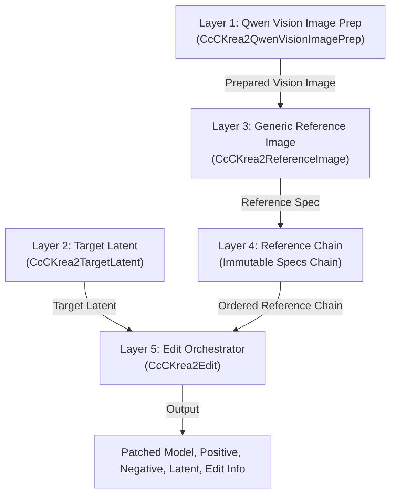

# CcC Krea2 Technical Architecture and Workflow Strategy

This document provides the canonical technical architecture and workflow strategy for `ComfyUI-CcC-Krea2`. It details the 5-layer modular pipeline, image representation models, Target Latent combinations, reference order resolution, directive-only anchor parity, and practical workflow strategies for production deployment.

---

## 1. Goals and Design Principles

1. **Tested Upstream Parity**: Tested parity against the exact upstream commits recorded in NOTICE (`ComfyUI-Krea2Edit` commit `5f8a02c` and `ComfyUI-Krea2Moodboard` commit `a7d83f1`). Parity applies specifically to those recorded upstream revisions; future upstream changes may require revalidation, and project-specific extensions are intentionally not upstream behavior.
2. **Modular 5-Layer Pipeline**: Decouple image prep, target latent creation, declarative reference definitions, immutable chain ordering, and edit orchestration into dedicated, composable nodes.
3. **Triple Image Representations**: Explicitly separate raw source images, Qwen Vision semantic images (`vision_image`), and spatial VAE reference latents (`vae_reference_latent`).
4. **Deterministic Reference Ordering**: Single-source slot resolution ensuring all non-Style references precede Style references in physical token streams and VAE spatial frames.

### Project-Specific Architectural Extensions
The following features are project-specific extensions designed for modular ComfyUI pipelines and are intentionally distinct from upstream single-script behavior:
- `crop_only` zero-interpolation center crop optimization in Auto visual fit mode.
- Declarative Reference Chain (`REFERENCE_CHAIN`) node abstraction.
- Independent Target Latent Content (`target_content`) and Target Geometry (`geometry_mode`) creation.
- System-wide `global_vision_directive` and node-level `vision_instruction` support.
- Independent `masked_attention_boost` controls.
- Multi-reference single-source reference chain orchestration.

---

## 2. Five-Layer Modular Architecture

- **Layer 1 (Qwen Vision Image Prep)**: Resizes raw image into a lightweight Qwen-optimized derivative (`vision_image`) aligned to patch boundaries (`32x32`), while retaining the untouched raw source image (`original_image`) intact for VAE processing.
- **Layer 2 (Target Latent)**: Resolves the target latent tensor (`[B, 16, H//8, W//8]`), independently configuring Latent Content Source (`empty`, `image`) and Target Geometry (`favor_image`, `fixed`).
- **Layer 3 (Declarative References)**: Defines per-reference specs (Generic Reference Image), configuring visual fit modes (`auto`, `fit`, `crop`), attention boosts, masks, and style processing mode. The Advanced pipeline is **generic infrastructure**, while the Easy Edit node provides the **opinionated recipe**.
- **Layer 4 (Reference Chain)**: Maintains an immutable linked chain of reference specifications (`REFERENCE_CHAIN`). Reference definition nodes accept an optional `previous_references` input and produce an updated `reference_chain` output.
- **Layer 5 (Edit Orchestrator)**: Consumes the resolved reference chain via its `references` input, resolves physical Qwen indices and VAE frame numbers, executes Qwen text/vision encoding, applies Moodboard statistical transforms, patches diffusion model attention hooks, and formats `edit_info`.

---

## 3. The Three Image Representations

In this architecture, an input image exists in up to three distinct representations:

1. **Original Image**: The unmodified raw pixel tensor (`[B, H, W, C]`) provided by the user. Preserved intact for VAE reference crop/fit processing in Layer 5.
2. **Vision Image**: The semantic derivative prepared by Layer 1 (`CcCKrea2QwenVisionImagePrep`) aligned to Qwen patch factor (`16 * 2 = 32`). Used exclusively for Qwen3-VL tokenization and visual context.
3. **VAE Reference Latent**: The fitted pixel image cropped, scaled, and encoded via VAE into spatial reference latents (`[B, 16, H//8, W//8]`). Used for spatial cross-attention patching in the diffusion model.

> [!NOTE]
> `CcCKrea2QwenVisionImagePrep` does **not** perform grounding itself. Grounding occurs when Qwen processes prepared images, aliases, vision instructions, global vision directives, and positive or negative prompts during orchestration in Layer 5.

---

## 4. CLIP Loader & Independent Semantic Image Sizing

- **CLIP Loader**: The Qwen3-VL text encoder must be loaded using ComfyUI's native **CLIPLoader** node configured with the `krea2` model type.
- **Semantic Sizing**: Semantic vision image sizing (`vision_image`) is strictly independent of VAE latent output sizing (`vae_reference_latent`):
  - **Native Mode**: Computes exact Qwen2-VL / Qwen3-VL native aspect-ratio grid geometry adhering to `min_pixels` (3,136) and `max_pixels` (12,845,056).
  - **Adaptive Mode**: Resizes within user-configured minimum (`min_mp`) and maximum (`max_mp`) megapixels while retaining source aspect ratio.
  - **Fixed Mode**: Standardizes vision inputs to a specific fixed megapixel resolution (`fixed_mp`) regardless of source dimensions.

> [!IMPORTANT]
> Semantic image size and output image size are completely decoupled. A higher semantic megapixel setting may improve small-detail Qwen understanding, but it does **not** automatically improve VAE identity preservation or increase VAE latent output resolution.

---

## 5. Target Latent: Content versus Geometry

`CcCKrea2TargetLatent` separates **Target Latent Content** from **Target Geometry**:

- **Target Latent Content**: `empty` (`Empty`, zeros tensor) or `image` (`Image`, VAE-encoded target_image).
- **Target Geometry**: `favor_image` (`Favor Image`, dimensions derived from the connected geometry image) or `fixed` (`Fixed`, dimensions derived from fixed megapixel / aspect ratio selection).

Inputs: `target_content`, `geometry_mode`, `target_megapixels`, `fixed_megapixels`, `aspect_ratio`, `batch_size`. Optional inputs: `vae`, `geometry_image`. VAE and Geometry image are required at runtime based on the selected content and geometry options.

Outputs:
- `target_latent` — `LATENT`
- `latent_info` — `STRING`

---

## 6. Workflow Strategy & Target Latent Matrix

The four combinations of Target Content and Geometry define the canonical target initialization for the pipeline:

| Target Content | Target Geometry | References Required | Main objective |
|---|---|---|---|
| `image` | `favor_image` | Target Image, Geometry Image | Maximum identity/scene continuity (e.g. `PRESERVE_IDENTITY`). Denoising starts from VAE-encoded target_image at exact geometry_image proportions. |
| `empty` | `favor_image` | Geometry Image | Free text-driven generation but strictly constrained to the aspect ratio and dimensional properties of the geometry_image. |
| `image` | `fixed` | Target Image | Fixed-resolution generation (e.g. 1024x1024) initializing denoising from the target_image. Requires `auto` or `crop` scaling. |
| `empty` | `fixed` | None | Pure text-to-image or unconstrained generation at fixed target resolution (e.g. `MAX_IDENTITY` fallback without image). |

> [!NOTE]
> **Compatibility**: Legacy modes (`target_content`: `subject`, `scene`; `geometry_mode`: `favor_subject`, `favor_scene`) remain supported for backward compatibility with older workflows but are transparently routed to `image` and `favor_image` utilizing their respective connected inputs. Modern workflows should use the generic `geometry_image` socket and `favor_image` mode.

---

## 7. Visual Reference Fit Options

- **`auto`**: Evaluates source vs target dimensions:
  - **`exact`**: Selected when source dimensions match target dimensions exactly (`src == tgt`). Performs no crop, no resize, and no interpolation.
  - **`crop_only`**: Selected only inside `auto` when the source is slightly larger than the target (`src >= tgt`), requiring at most 5% discarded per dimension (`dw_pct <= 0.05` and `dh_pct <= 0.05`) and at most 10% total area discarded (`area_discarded <= 0.10`). Performs an exact target-size center crop without resize or interpolation.
  - **`crop_and_resize`**: Selected for the upstream near-match aspect ratio path when dimensional coverage is at least 92% (`coverage_h >= 0.92` and `coverage_w >= 0.92`). Performs a center crop to target aspect ratio followed by bicubic interpolation and antialiasing to exact target pixel dimensions.
  - **`fit`**: Selected for genuine aspect ratio mismatches (`coverage < 0.92`). Performs a Krea2Edit-compatible source crop and resizes to `/16`-aligned VAE reference dimensions with fractional centered RoPE offsets, preserving reference geometry without black or gray pixel padding canvas.
- **Manual `fit`**: Uses upstream near-match (`crop_and_resize`) or genuine mismatch (`fit`) behavior, explicitly bypassing the `auto`-only `crop_only` optimization.
- **Manual `crop`**: Performs a center crop to target aspect ratio and resizes directly to exact target pixel dimensions using bicubic interpolation.

> [!NOTE]
> Pixel-space reference fitting occurs **only in Layer 5 (Edit Orchestrator)** when target latent dimensions are known. Reference definition nodes (Layer 3) declare the requested fit mode.

---

## 8. Reference Roles and Single-Source Ordering

The single source of truth for reference ordering is `easy_routing.py` for Easy Edit nodes and `reference_slots.py` for manual nodes. All non-Style references (**Subject**, **Scene**, **Outfit**) precede all **Style** references.

1. **Easy Routing Engine**: For `CcCKrea2EasyEdit` / `CcCKrea2EasyEditOstris`, a unified 8-combination routing matrix dynamically resolves the visual context based on the selected preset (e.g., `balanced`, `style_transfer`, `preserve_identity`, `outfit_transfer`) and the connected image inputs. This matrix automatically builds the internal reference chain, dynamically constructs semantic Scene+Outfit instructions, and filters disconnected references.
2. **Non-Style References (Subject, Scene, Outfit)**: Map 1:1 to physical Qwen images and assign sequential 1-based VAE Reference Frames (`Frame 1`, `Frame 2`, etc.). Under Ostris Backend, all edit-path references (including semantic-only references) undergo strict VLM Area Preprocessing (<= 384x384) before text/vision encoding.
3. **Style References**: Expand to 1 (full), 4 (2x2), or 16 (4x4) physical Qwen vision images. Style references receive VAE Reference Frame = `none` and do not participate in spatial VAE latent attention patching or negative conditioning.

---

## 9. Moodboard Style Processing

1. **Statistical Style Fidelity**:
   Transforms Style vision conditioning tokens $z_{\text{orig}}$ via:
   $$z_{\text{out}} = \text{fidelity} \cdot z_{\text{orig}} + (1.0 - \text{fidelity}) \cdot z_{\text{target}}$$
   where $z_{\text{target}}$ is constructed by cycling mean $\mu$, $\mu + \sigma$, and $\mu - \sigma$ computed across visual rows.
2. **Indirect Style Transfer**:
   - Style images participate fully in Qwen contextualization during text/vision encoding.
   - Style visual rows are identified after encoding.
   - Every visual row belonging to an indirect Style reference is removed in **one single operation** using a consolidated boolean keep-mask.
   - Prompt rows remain intact.
   - Subject, Scene, Outfit, and direct Style rows remain intact when present.
   - No Style visual span is forcibly preserved for an indirect Style reference. Indirect transfer retains contextual influence through remaining non-Style and prompt conditioning tokens rather than a mandatory retained Style span.

---

## 10. Positive and Negative Conditioning

- **Positive Qwen Context**: Includes Easy logical role images or Advanced generic references, expanded Style images/directives, global vision directive, positive prompt, and prompt augmentation.
- **Negative Qwen Context**: Includes Easy logical role images or Advanced generic references, negative prompt, and negative prompt augmentation. **Strictly excludes all Style images, crops, tiles, Style instructions, Moodboard operations, and global vision directives.**

---

## 11. Legacy Compatibility

- **Directive-Only Anchors Parity**: Text anchors modulate Qwen Vision prompt directives only, without modifying attention hooks, VAE latents, or RoPE geometry:
   - **Subject**: Pose Anchor, Outfit Anchor, Masked Identity Anchor
   - **Scene**: Scene Anchor, Masked Region Anchor
   - **Outfit**: Outfit Anchor

---

## 12. Upstream Parity and Attribution

- Ported from and attributed to `ComfyUI-Krea2Edit` by lbouaraba (Apache-2.0 / GPL-3.0) and `ComfyUI-Krea2Moodboard` by RedNodeAI (GPL-3.0).
