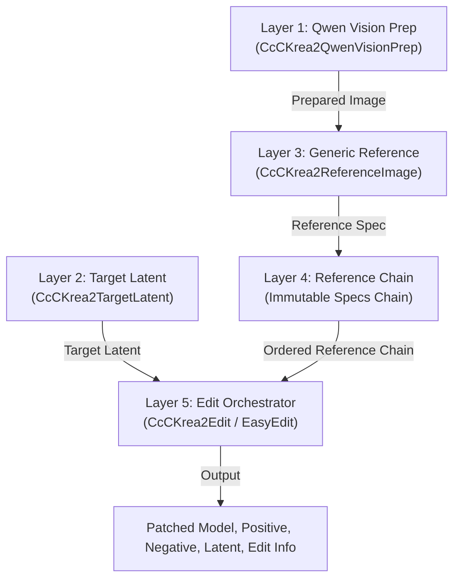

# ComfyUI-CcC-Krea2

[](https://github.com/demonccc/ComfyUI-CcC-Krea2/actions/workflows/ci.yml)

`ComfyUI-CcC-Krea2` is a 5-layer modular architecture for advanced Krea 2 image editing, reference conditioning, identity preservation, and Ostris edit workflows in ComfyUI.

---

## Key Documentation

- 📖 **[Node Reference (NODES.md)](NODES.md)**: Complete parameter, input type, socket, and node specifications.
- 📐 **[Technical Architecture and Workflow Strategy (ARCHITECTURE.md)](ARCHITECTURE.md)**: Detailed breakdown of the 5-layer pipeline, Native vs Krea2Edit vs Ostris backends, Qwen Vision context mechanics, and resolution math.
- 📜 **[Changelog (CHANGELOG.md)](CHANGELOG.md)**: Revision history and version logs.

---

## 5-Layer Modular Architecture



1. **Layer 1: Qwen Vision Prep (`CcCKrea2QwenVisionPrep`)**: Prepares derivative images (`vision_image`) optimized for Qwen Vision tokenization (Native, Adaptive, or Fixed MP) while retaining original pixel tensors for VAE processing.
2. **Layer 2: Target Latent (`CcCKrea2TargetLatent`)**: Creates the target latent container, independently configuring `target_content` (`empty`, `image`) and `geometry_mode` (`fixed`, `favor_image`). Supports Target Vision Context inclusion without triggering VAE appearance frames.
3. **Layer 3: Declarative Reference Node (`CcCKrea2ReferenceImage`)**: Generic reference configuration for edit (appearance/semantic) and style paths. Legacy role nodes (`Subject`, `Scene`, `Outfit`, `Style`) are deprecated in favor of generic reference nodes and Easy presets.
4. **Layer 4: Immutable Reference Chain**: Links reference specifications in strict non-Style before Style order.
5. **Layer 5: CcC Edit Orchestrator (`CcCKrea2Edit`, `CcCKrea2EasyEdit`, `CcCKrea2EasyEditOstris`)**: Executes Qwen tokenization using `KREA2_TEMPLATE`, backend-specific reference transport (Krea2 RoPE/Boost wrapper, Ostris `index_timestep_zero`, or Native `reference_latents`), and report generation.

---

## Backends: Native vs Krea2Edit vs Ostris

| Backend | Reference Transport | Qwen Prompt Format | VAE Pixel Prep | Model Patching |
| :--- | :--- | :--- | :--- | :--- |
| **Krea2 Edit** | CcC Krea2 Model Wrapper | Canonical `<VISION>` blocks + text | Krea2 geometry & RoPE alignment | `patch_krea2_model` |
| **Ostris Edit** | `index_timestep_zero` | `Picture N: <VISION>` blocks + text | Ostris 1024x1024 /16 snapped pixels | `patch_ostris_model` (object patch) |
| **Native** | Standard `reference_latents` | Canonical `<VISION>` blocks + text | Direct `vae.encode` (unmodified) | None (Unpatched) |

---

## Quick-Start Workflow Example

1. Load CLIP using **CLIPLoader** configured with model type `krea2`.
2. Connect `CLIP` and source image to **CcC Krea2 - Qwen Vision Image Prep**.
3. Connect the prepared image output (`prepared_image`) to both:
   - **CcC Krea2 - Reference Image** (`prepared_image` input) for reference attention guidance;
   - **CcC Krea2 - Target Latent** (`subject_image` input) to compute output resolution geometry when favoring subject geometry.
4. Configure **CcC Krea2 - Target Latent** (`target_content` = `"empty"`, `geometry_mode` = `"favor_image"`). Selecting `target_content` = `"empty"` means denoising starts from pure noise, while `geometry_mode` = `"favor_image"` uses the connected `subject_image` input to calculate output dimensions.
5. Connect Reference Chain output (`reference_chain`) to `references` input and Target Latent output (`target_latent`) to `target_latent` input on **CcC Krea2 - Edit**.
6. Connect outputs `patched_model`, `positive`, `negative`, and `latent` to KSampler (`latent` connects to `KSampler.latent_image`).

---

## Canonical Workflows Index

Find pre-built workflow JSON files in the `workflows/` directory:

- ⚡ [`01_easy_edit_balanced.json`](workflows/01_easy_edit_balanced.json): Opinionated Easy Edit Preset Pipeline
- 🧪 [`02_easy_edit_ostris.json`](workflows/02_easy_edit_ostris.json): Ostris Easy Edit Pipeline
- 👤 [`03_subject_edit.json`](workflows/03_subject_edit.json): Single Subject Reference Editing
- 🏞️ [`04_scene_edit.json`](workflows/04_scene_edit.json): Single Scene Reference Editing
- 🎭 [`05_subject_and_scene_edit.json`](workflows/05_subject_and_scene_edit.json): Dual Reference Composition (Subject + Scene)
- 👗 [`06_outfit_transfer.json`](workflows/06_outfit_transfer.json): Garment & Outfit Transfer Workflow
- 🖼️ [`07_style_transfer.json`](workflows/07_style_transfer.json): Style Moodboard Tile Transfer Workflow
- 🏛️ [`08_native_reference_edit.json`](workflows/08_native_reference_edit.json): Standard ComfyUI Native `reference_latents` Workflow
- ⚙️ [`09_advanced_multi_reference.json`](workflows/09_advanced_multi_reference.json): Advanced Multi-Reference Chain & Target Vision Context
- 🎨 [`10_t2i_generation.json`](workflows/10_t2i_generation.json): Text-to-Image Generation & LoRA Stacking

Legacy workflow files targeting earlier role-node contracts are stored in [`workflows/legacy/`](workflows/legacy/).

---

## Installation

```bash
cd ComfyUI/custom_nodes
git clone https://github.com/demonccc/ComfyUI-CcC-Krea2.git
```

Restart ComfyUI after cloning.

---

## License

Licensed under the GNU General Public License v3.0 (GPL-3.0). See [LICENSE](LICENSE) and [NOTICE](NOTICE) for full details.
