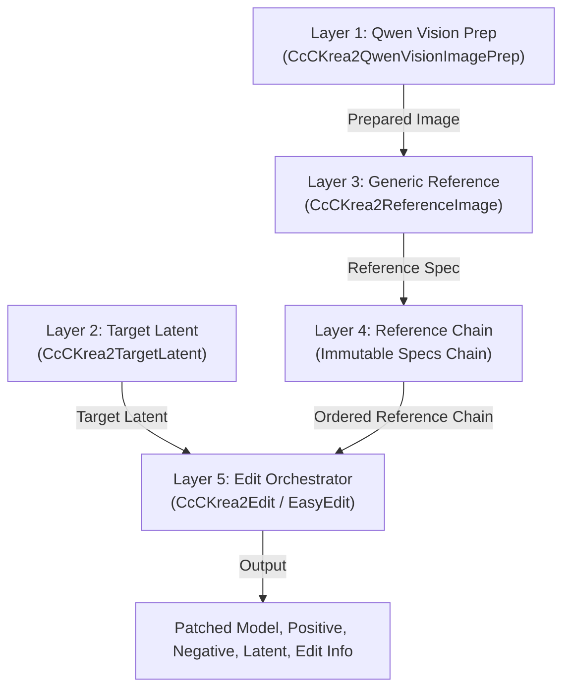

# ComfyUI-CcC-Krea2

[](https://github.com/demonccc/ComfyUI-CcC-Krea2/actions/workflows/ci.yml)

`ComfyUI-CcC-Krea2` is a 5-layer modular architecture for advanced Krea 2 image editing, reference conditioning, identity preservation, and Ostris edit workflows in ComfyUI.

---

## Key Documentation

- 📖 **[Node Reference (NODES.md)](NODES.md)**: Complete parameter, input type, socket, and node specifications.
- 📐 **[Technical Architecture and Workflow Strategy (ARCHITECTURE.md)](ARCHITECTURE.md)**: Detailed breakdown of the 5-layer pipeline, Native vs Krea2Edit vs Ostris backends, Qwen Vision context mechanics, and resolution math.
- 📜 **[Changelog (CHANGELOG.md)](CHANGELOG.md)**: Revision history and version logs.

---

## 5-Layer Modular Architecture



1. **Layer 1: Qwen Vision Prep (`CcCKrea2QwenVisionImagePrep`)**: Prepares derivative images (`vision_image`) optimized for Qwen Vision tokenization (Native, Adaptive, or Fixed MP) while retaining original pixel tensors for VAE processing.
2. **Layer 2: Target Latent (`CcCKrea2TargetLatent`)**: Creates the target latent container, independently configuring `target_content` (`empty`, `image`) and `geometry_mode` (`fixed`, `favor_image`). Supports Target Vision Context inclusion without triggering VAE appearance frames.
3. **Layer 3: Declarative Reference Node (`CcCKrea2ReferenceImage`)**: Generic reference configuration for edit (appearance/semantic) and style paths. Legacy role nodes (`Subject`, `Scene`, `Outfit`, `Style`) are deprecated in favor of generic reference nodes and Easy presets.
4. **Layer 4: Immutable Reference Chain**: Links reference specifications in strict non-Style before Style order.
5. **Layer 5: CcC Edit Orchestrator (`CcCKrea2Edit`, `CcCKrea2EasyEdit`, `CcCKrea2EasyEditOstris`)**: Executes Qwen tokenization using `KREA2_TEMPLATE`, backend-specific reference transport (Krea2 RoPE/Boost wrapper, Ostris `index_timestep_zero`, or Native `reference_latents`), and report generation.

---

## Backends: Native vs Krea2Edit vs Ostris

| Backend | Reference Transport | Qwen Prompt Format | VAE Pixel Prep | Model Patching |
| :--- | :--- | :--- | :--- | :--- |
| **Krea2 Edit** | CcC Krea2 Model Wrapper | Canonical `<VISION>` blocks + text | Krea2 geometry & RoPE alignment | `patch_krea2_model` |
| **Ostris Edit** | `index_timestep_zero` | `Picture N: <VISION>` blocks + text | Aspect-preserving, max 1 MP, /16 snapped | None for canonical current ComfyUI execution |
| **Native** | Standard `reference_latents` | Canonical `<VISION>` blocks + text | Direct `vae.encode` (unmodified) | None (Unpatched) |

---

## Easy Edit Presets

Easy Edit provides presets ranging from maximum editing freedom to maximum identity anchoring.

| Preset | Editing Freedom | Identity / Reference Anchoring | Recommended Use |
| --- | --- | --- | --- |
| **Flexible** | Very High | Low / Neutral | Large creative changes, new poses, exploratory edits |
| **Balanced** | High | Moderate | General-purpose edits when no strong preservation mode is required |
| **Consistent** | Medium-High | Stronger | General editing with better Subject consistency |
| **Preserve Identity** | Medium | Strong | Keep the same person while changing scene, outfit, or pose |
| **Max Identity** | Lower | Maximum | Identity-critical edits where preserving the person is the priority |

```
Flexible
   ↓
Balanced
   ↓
Consistent
   ↓
Preserve Identity
   ↓
Max Identity
```

Increasing reference anchoring generally means less freedom for pose, composition, and reinterpretation.

### Target Content Routing Groups

The identity presets fall into two distinct structural routing families for Subject-only editing:

- **Free Target Content Group** (`Flexible`, `Balanced`, `Consistent`): Sets `Target Content = empty`. Denoising starts from noise, allowing the Subject reference to guide generation via reference attention while keeping target latents free for major creative changes.
- **Subject-Anchored Target Content Group** (`Preserve Identity`, `Max Identity`): Sets `Target Content = Subject image`. The Subject image acts as both appearance reference and initial target content, providing stronger identity and structural anchoring.

With both **Subject** and **Scene** connected, `Flexible`, `Balanced`, and `Consistent` keep Scene-driven geometry while starting from free target content. `Preserve Identity` and `Max Identity` switch structural anchoring to the Subject. `Preserve Scene` does the opposite, making the Scene the target and geometry anchor.

### System-Managed Default Prompts (`Use Default Prompt`)

Easy Edit nodes include a **Use Default Prompt** toggle (`use_default_prompt`, default `true`):

- **Default Mode (`Use Default Prompt = true`)**: The node automatically resolves an optimized positive prompt based on the active preset and connected reference images (e.g., `subject_scene`, `outfit_transfer`, `subject_scene_outfit`, `style`). When enabled, the prompt field displays the active system prompt and updates automatically as presets or inputs change.
- **Custom Mode (`Use Default Prompt = false`)**: Gives full prompt control to the user. The text area is editable and preserves user-entered text without being overwritten when presets or connections change.
- **Subject-only Exception**: When only a Subject image is connected, no default edit intent exists. `Use Default Prompt` is disabled, forcing custom mode, and a non-empty positive prompt is strictly required.

| Goal | Suggested Preset |
| --- | --- |
| Maximum freedom while using a Scene reference | **Flexible** |
| General Subject + Scene editing | **Balanced** |
| More stable Subject while keeping Scene geometry | **Consistent** |
| Strong Subject identity preservation | **Preserve Identity** |
| Maximum Subject identity anchoring | **Max Identity** |
| Maximum Scene preservation | **Preserve Scene** |

### Task-Specific Presets

The identity ladder covers subject preservation tasks. Additional task-specific presets provide targeted capabilities:

- **Subject Transfer**: Strongly transfers Subject identity into the target while allowing the Scene (when available) to define the target content/geometry anchor (Subject boost: 8.0, effective Outfit boost: 4.0).
- **Preserve Scene**: Prioritizes preserving the connected Scene composition, background, and visual context.
- **Outfit Transfer**: Prioritizes transferring clothing from the selected Outfit source onto the Subject.
- **Style Transfer**: Uses the dedicated Style/Moodboard path to transfer artistic style, palette, texture, and visual mood.

---

## Quick-Start Workflow Example

1. Load CLIP using **CLIPLoader** configured with model type `krea2`.
2. Connect `CLIP` and source image to **CcC Krea2 - Qwen Vision Image Prep**.
3. Connect the prepared image output (`prepared_image`) to both:
   - **CcC Krea2 - Reference Image** (`prepared_image` input) for reference attention guidance;
   - **CcC Krea2 - Target Latent** (`geometry_image` input) to compute output resolution geometry when favoring image geometry.
4. Configure **CcC Krea2 - Target Latent** (`target_content` = `"empty"`, `geometry_mode` = `"favor_image"`). Selecting `target_content` = `"empty"` means denoising starts from pure noise, while `geometry_mode` = `"favor_image"` uses the connected `geometry_image` input to calculate output dimensions.
5. Connect Reference Chain output (`reference_chain`) to `references` input and Target Latent output (`target_latent`) to `target_latent` input on **CcC Krea2 - Edit**.
6. Connect outputs `patched_model`, `positive`, `negative`, and `latent` to KSampler (`latent` connects to `KSampler.latent_image`).

---

## Canonical Workflows Index

Find pre-built workflow JSON files in the `workflows/` directory:

- ⚡ [`01_easy_subject.json`](workflows/01_easy_subject.json): Single Subject Easy Edit
- 🏞️ [`02_easy_subject_scene.json`](workflows/02_easy_subject_scene.json): Subject + Scene Easy Edit
- 👗 [`03_easy_subject_outfit.json`](workflows/03_easy_subject_outfit.json): Subject + Outfit Easy Edit
- 🎨 [`04_easy_subject_scene_outfit.json`](workflows/04_easy_subject_scene_outfit.json): Subject + Scene + Outfit Easy Edit
- 👕 [`05_easy_outfit_from_scene.json`](workflows/05_easy_outfit_from_scene.json): Extract Outfit from Scene Context
- 🖼️ [`06_easy_style_transfer.json`](workflows/06_easy_style_transfer.json): Easy Style Transfer
- 🧪 [`07_easy_ostris.json`](workflows/07_easy_ostris.json): Easy Edit using Ostris Backend
- ⚙️ [`08_advanced_krea2_edit.json`](workflows/08_advanced_krea2_edit.json): Advanced Reference Chain (Krea2 Edit)
- 🏛️ [`09_advanced_native.json`](workflows/09_advanced_native.json): Advanced Reference Chain (Native ComfyUI backend)
- 🧪 [`10_advanced_ostris.json`](workflows/10_advanced_ostris.json): Advanced Reference Chain (Ostris backend)

Legacy workflow files targeting earlier role-node contracts are stored in [`workflows/additional/`](workflows/additional/) and [`workflows/legacy/`](workflows/legacy/).

---

## Installation

```bash
cd ComfyUI/custom_nodes
git clone https://github.com/demonccc/ComfyUI-CcC-Krea2.git
```

Restart ComfyUI after cloning.

---

## License

Licensed under the GNU General Public License v3.0 (GPL-3.0). See [LICENSE](LICENSE) and [NOTICE](NOTICE) for full details.
