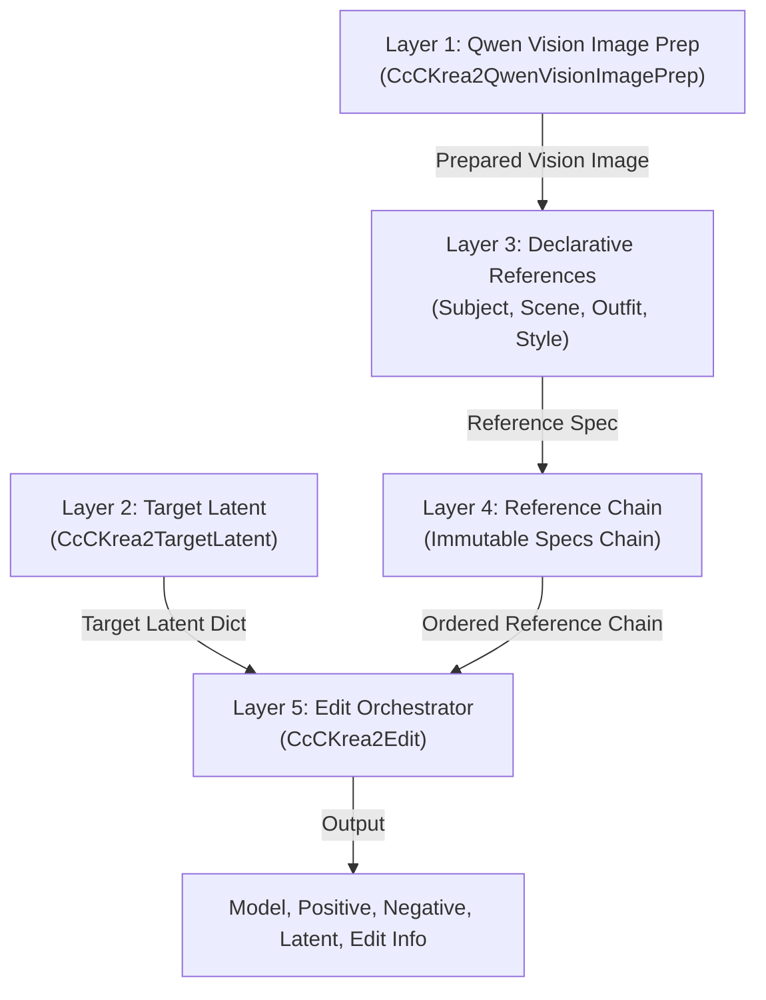

# ComfyUI-CcC-Krea2

[](https://github.com/demonccc/ComfyUI-CcC-Krea2/actions/workflows/ci.yml)

`ComfyUI-CcC-Krea2` is a 5-layer modular architecture for advanced Krea 2 image editing, reference conditioning, and identity preservation in ComfyUI.

---

## Key Documentation

- 📖 **[Node Reference (NODES.md)](NODES.md)**: Complete parameter, input type, socket, and node specifications.
- 📐 **[Technical Architecture and Workflow Strategy (ARCHITECTURE.md)](ARCHITECTURE.md)**: Detailed breakdown of the 5-layer pipeline, triple image representations, 9 Target Latent combinations matrix, and strategy recommendations.
- 📜 **[Changelog (CHANGELOG.md)](CHANGELOG.md)**: Revision history and version logs.

---

## 5-Layer Modular Architecture



1. **Layer 1: Qwen Vision Image Prep (`CcCKrea2QwenVisionImagePrep`)**: Prepares derivative images (`vision_image`) optimized for Qwen Vision tokenization while retaining original pixel tensors for VAE processing.
2. **Layer 2: Target Latent (`CcCKrea2TargetLatent`)**: Creates the target latent container, independently configuring Latent Content Source (`Empty`, `Subject`, `Scene`) and Target Geometry (`Favor Subject`, `Favor Scene`, `Fixed`).
3. **Layer 3: Declarative Reference Nodes (`Subject`, `Scene`, `Outfit`, `Style`)**: Configures reference specifications, visual reference fit modes (`Auto`, `Fit`, `Crop`), attention boosts, masks, and style fidelity.
4. **Layer 4: Immutable Reference Chain**: Links reference specifications in strict non-Style before Style order.
5. **Layer 5: CcC Krea2 Edit Orchestrator (`CcCKrea2Edit`)**: Executes Qwen tokenization, Moodboard style fidelity transforms, model patching, and report generation.

---

## Canonical Workflows Index

Find pre-built workflow JSON files in the `workflows/` directory:

- 🎨 [`01_t2i_basic.json`](workflows/01_t2i_basic.json): Native Text-to-Image Generation
- 🚀 [`02_t2i_lora_stack.json`](workflows/02_t2i_lora_stack.json): T2I + 4-slot LoRA Stack
- 👤 [`03_subject_edit.json`](workflows/03_subject_edit.json): Single Subject Reference Editing
- 🏞️ [`04_subject_scene_edit.json`](workflows/04_subject_scene_edit.json): Subject + Scene Reference Editing
- 👗 [`05_subject_outfit_edit.json`](workflows/05_subject_outfit_edit.json): Subject + Outfit Garment Transfer
- 🎭 [`06_subject_scene_outfit_edit.json`](workflows/06_subject_scene_outfit_edit.json): Triple Reference Composition
- 🖼️ [`07_style_moodboard_edit.json`](workflows/07_style_moodboard_edit.json): Subject + Style Moodboard Transfer
- 🖌️ [`08_inpaint_subject_edit.json`](workflows/08_inpaint_subject_edit.json): Subject Inpainting Reference Workflow
- 🏛️ [`09_inpaint_scene_edit.json`](workflows/09_inpaint_scene_edit.json): Scene Inpainting Reference Workflow
- 🔗 [`10_multi_subject_chasing_slots.json`](workflows/10_multi_subject_chasing_slots.json): Multi-Subject Logical Slot Resolution
- ⚙️ [`11_advanced_directives_fit_modes.json`](workflows/11_advanced_directives_fit_modes.json): Custom Directives and Fit Mode Options
- 🌟 [`12_full_pipeline_composition.json`](workflows/12_full_pipeline_composition.json): Full Composite Modular Pipeline

Legacy workflow files targeting earlier node contracts are stored in [`workflows/legacy/`](workflows/legacy/).

---

## Quick-Start Workflow Example

1. Connect `CLIP` and source image to **CcC Krea2 - Qwen Vision Image Prep**.
2. Connect prepared image to **CcC Krea2 - Subject Reference Node**.
3. Connect **CcC Krea2 - Target Latent** (`target_latent_content` = `"empty"`, `target_geometry` = `"favor_subject"`).
4. Connect Reference Chain and Target Latent to **CcC Krea2 - Edit**.
5. Connect output `model`, `positive`, `negative`, and `target_latent` to KSampler.

---

## Edit LoRA Requirements

`ComfyUI-CcC-Krea2` requires a Krea 2 edit LoRA (such as *Identity Edit v1.2*) trained for in-context editing. Standard text-to-image LoRAs do not provide spatial reference attention mechanisms.

---

## Installation

```bash
cd ComfyUI/custom_nodes
git clone https://github.com/demonccc/ComfyUI-CcC-Krea2.git
```

Restart ComfyUI after cloning.

---

## Credits & Attribution

Built upon architectural concepts, reference implementations, and design patterns from:
- [ComfyUI](https://github.com/comfyanonymous/ComfyUI) (GPL-3.0)
- [ComfyUI-Krea2Edit](https://github.com/lbouaraba/comfyui-krea2edit) by lbouaraba (Apache-2.0 / GPL-3.0)
- [ComfyUI-Krea2Moodboard](https://github.com/RedNodeAI/ComfyUI-Krea2Moodboard) by RedNodeAI (GPL-3.0)
- [ComfyUI-EditUtils](https://github.com/lrzjason/ComfyUI-EditUtils) by lrzjason (GPL-3.0)

---

## License

Licensed under the GNU General Public License v3.0 (GPL-3.0). See [LICENSE](LICENSE) and [NOTICE](NOTICE) for full details.
