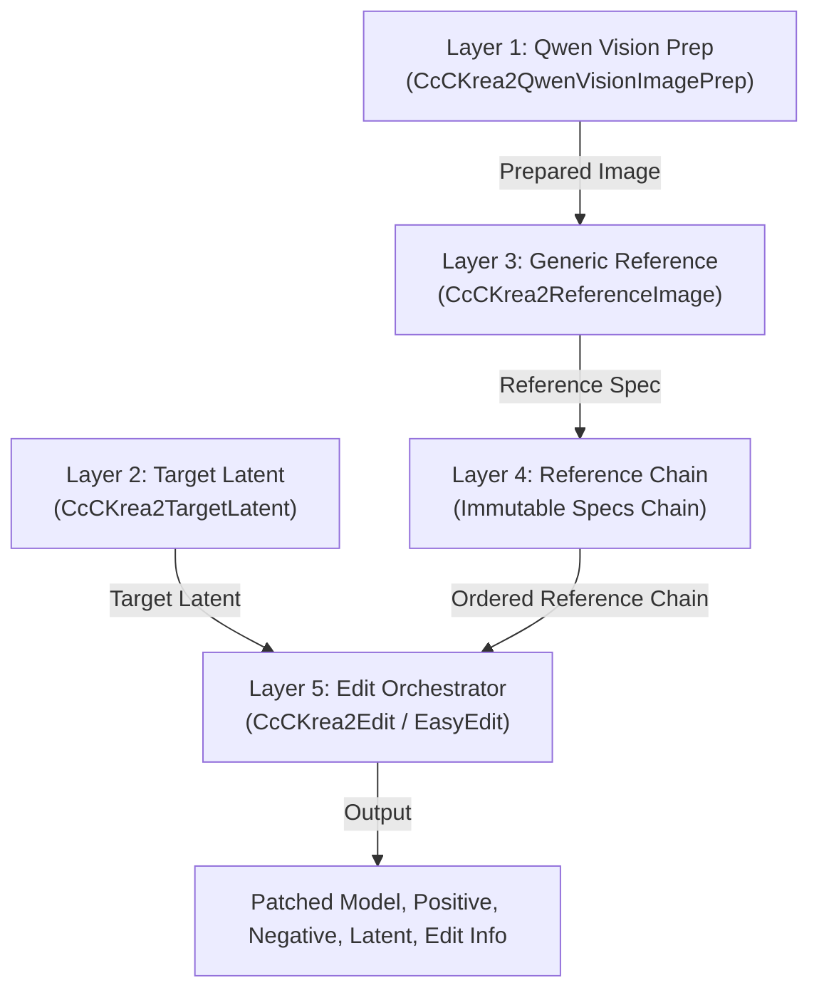

# ComfyUI-CcC-Krea2

[](https://github.com/demonccc/ComfyUI-CcC-Krea2/actions/workflows/ci.yml)

`ComfyUI-CcC-Krea2` is a 5-layer modular architecture for advanced Krea 2 image editing, reference conditioning, identity preservation, and Ostris edit workflows in ComfyUI.

---

## Key Documentation

- 📖 **[Node Reference (NODES.md)](NODES.md)**: Complete parameter, input type, socket, and node specifications.
- 📐 **[Technical Architecture and Workflow Strategy (ARCHITECTURE.md)](ARCHITECTURE.md)**: Detailed breakdown of the 5-layer pipeline, Native vs Krea2Edit vs Ostris backends, Qwen Vision context mechanics, and resolution math.
- 📜 **[Changelog (CHANGELOG.md)](CHANGELOG.md)**: Revision history and version logs.

---

## 5-Layer Modular Architecture



1. **Layer 1: Qwen Vision Prep (`CcCKrea2QwenVisionImagePrep`)**: Prepares derivative images (`vision_image`) optimized for Qwen Vision tokenization (Native, Adaptive, or Fixed MP) while retaining original pixel tensors for VAE processing.
2. **Layer 2: Target Latent (`CcCKrea2TargetLatent`)**: Creates the target latent container, independently configuring `target_content` (`empty`, `image`) and `geometry_mode` (`fixed`, `favor_image`). Supports Target Vision Context inclusion without triggering VAE appearance frames.
3. **Layer 3: Declarative Reference Node (`CcCKrea2ReferenceImage`)**: Generic reference configuration for edit (appearance/semantic) and style paths. Legacy role nodes (`Subject`, `Scene`, `Outfit`, `Style`) are deprecated in favor of generic reference nodes and Easy presets.
4. **Layer 4: Immutable Reference Chain**: Links reference specifications in strict non-Style before Style order.
5. **Layer 5: CcC Edit Orchestrator (`CcCKrea2Edit`, `CcCKrea2EasyEdit`, `CcCKrea2EasyEditOstris`)**: Executes Qwen tokenization using `KREA2_TEMPLATE`, backend-specific reference transport (Krea2 RoPE/Boost wrapper, Ostris `index_timestep_zero`, or Native `reference_latents`), and report generation.

---

## Backends: Native vs Krea2Edit vs Ostris

| Backend | Reference Transport | Qwen Prompt Format | VAE Pixel Prep | Model Patching |
| :--- | :--- | :--- | :--- | :--- |
| **Krea2 Edit** | CcC Krea2 Model Wrapper | Canonical `<VISION>` blocks + text | Krea2 geometry & RoPE alignment | `patch_krea2_model` |
| **Ostris Edit** | `index_timestep_zero` | `Picture N: <VISION>` blocks + text | Aspect-preserving, max 1 MP, /16 snapped | None for canonical current ComfyUI execution |
| **Native** | Standard `reference_latents` | Canonical `<VISION>` blocks + text | Direct `vae.encode` (unmodified) | None (Unpatched) |

---

## Easy Edit Presets

Easy Edit provides presets ranging from maximum editing freedom to maximum identity anchoring.

| Preset | Editing Freedom | Identity / Reference Anchoring | Recommended Use |
| --- | --- | --- | --- |
| **Flexible** | Very High | Low / Neutral | Large creative changes, new poses, exploratory edits |
| **Balanced** | High | Moderate | General-purpose edits when no strong preservation mode is required |
| **Consistent** | Medium-High | Stronger | General editing with better Subject consistency |
| **Preserve Identity** | Medium | Strong | Keep the same person while changing scene, outfit, or pose |
| **Max Identity** | Lower | Maximum | Identity-critical edits where preserving the person is the priority |

```
Flexible
   ↓
Balanced
   ↓
Consistent
   ↓
Preserve Identity
   ↓
Max Identity
```

Increasing reference anchoring generally means less freedom for pose, composition, and reinterpretation.

### Target Content Routing Groups

The identity presets fall into two distinct structural routing families for Subject-only editing:

- **Free Target Content Group** (`Flexible`, `Balanced`, `Consistent`): Sets `Target Content = empty`. Denoising starts from noise, allowing the Subject reference to guide generation via reference attention while keeping target latents free for major creative changes.
- **Subject-Anchored Target Content Group** (`Preserve Identity`, `Max Identity`): Sets `Target Content = Subject image`. The Subject image acts as both appearance reference and initial target content, providing stronger identity and structural anchoring.

With both **Subject** and **Scene** connected, `Flexible`, `Balanced`, and `Consistent` keep Scene-driven geometry while starting from free target content. `Preserve Identity` and `Max Identity` switch structural anchoring to the Subject. `Preserve Scene` does the opposite, making the Scene the target and geometry anchor.

### System-Managed Default Prompts & Custom Conversion

Easy Edit nodes include a **Use Default Prompt** toggle (`use_default_prompt`, default `true`) and a **Use Preset as Custom** action button:

- **Default Mode (`Use Default Prompt = true`)**: The node automatically resolves an optimized positive prompt based on the active preset and connected reference images (e.g., `subject_scene`, `subject_transfer_1`, `scene_reinterpretation`, `outfit_transfer`, `style`). When enabled, the prompt field displays the active system prompt and updates automatically as presets or inputs change.
- **Custom Mode (`Use Default Prompt = false`)**: Gives full prompt control to the user. The text area is editable and preserves user-entered text without being overwritten when presets or connections change.
- **Use Preset as Custom Button**: Clicking this action button copies the current resolved preset prompt into the text area, sets `Use Default Prompt = false`, unlocks the prompt for editing, and disconnects future preset/input changes from overwriting user modifications.
- **Subject-only Exception**: When only a Subject image is connected, no default edit intent exists. `Use Default Prompt` is disabled, forcing custom mode, and a non-empty positive prompt is strictly required.

| Goal | Suggested Preset |
| --- | --- |
| Maximum freedom while using a Scene reference | **Flexible** |
| General Subject + Scene editing | **Balanced** |
| More stable Subject while keeping Scene geometry | **Consistent** |
| Strong Subject identity preservation | **Preserve Identity** |
| Maximum Subject identity anchoring | **Max Identity** |
| Maximum Scene preservation | **Preserve Scene** |
| Reinterpret action/pose/environment of Scene creatively | **Scene Reinterpretation** |

### Task-Specific Presets

The identity ladder covers subject preservation tasks. Additional task-specific presets provide targeted capabilities:

- **Identity Transfer**: Transfers the identity of the Subject to the target person in the Scene while keeping the Scene clothing, pose, and surroundings intact. Uses the Scene image as both target content and geometry anchor, with Scene and Subject appearance boosts of `2.0`. Naturally aligned with Conrad Identity Edit LoRA (`krea2_identity_edit_v1_2.safetensors`).
- **Subject Transfer**: Replaces the target person while preserving the Subject identity, anatomy, clothing, and accessories. It starts from an empty latent with Scene geometry, uses guarded direct Scene/Subject appearance references at `1.0` / `2.5`, reinforces the Subject outfit through an automatic direct Outfit semantic reference, and uses Scene as automatic indirect Style guidance.
- **Flexible Subject Transfer 1 / 2**: Uses Scene and Subject as the two appearance references. Outfit is independently selectable from none, Subject (default), or Scene and travels through a direct semantic Style path with outfit-only guardrails. Artistic Style is independently selectable and uses the global indirect style-only profile.
- **Scene Reinterpretation**: Creatively reinterprets the Scene without target image initialization. Scene defines geometry and is also a locked direct Style reference with custom guidance for composition, pose, actions, interactions, environment, objects, lighting, and spatial relationships while excluding the replaced subject's identity and outfit. Subject is the primary appearance reference (`7.0`). Outfit defaults to Scene and remains selectable from none, Subject, Scene, Outfit, or Style as an appearance reference (`4.0`). The former duplicate Scene semantic-only reference is not used.
- **Preserve Scene**: Prioritizes preserving the connected Scene composition, background, and visual context (Outfit policy: disabled).
- **Outfit Transfer**: Prioritizes transferring clothing from the selected Outfit source onto the Subject.
- **Style Transfer**: Uses the dedicated indirect Style/Moodboard path to transfer artistic style, palette, texture, and visual mood without retaining the source Style image rows (Outfit policy: disabled).

With Subject + Scene, Easy Edit first reduces Scene geometry only when it exceeds the 2.5 MP hard cap. The Subject dimensions are rounded up to their `/16` conditioning bounds without interpolation. If those bounds fit, the latent keeps the Scene size and Subject remains untouched. Otherwise the latent expands with the Scene aspect ratio until Subject fits, capped at 2.5 MP; Subject is reduced only when it still cannot fit after that cap. Subject and Outfit appearance references use `contain_no_upscale`, while Scene and combined Scene+Outfit use `contain`.

Easy Edit also exposes **Aspect Ratio** with `auto`, `1:1`, `3:2`, `2:3`, `4:3`, `3:4`, `16:9`, and `9:16`. `auto` keeps the source-driven behavior. An explicit ratio creates the smallest output canvas that contains the complete Subject at native size; if Subject is absent, Scene becomes the anchor. The selected ratio expands the canvas rather than stretching or cropping the anchor. Only the 2.5 MP hard cap may force a proportional downscale.

> [!NOTE]
> **Placeholder-Driven Default Prompts & Subject Fields**:
> Easy Edit preset prompts dynamically substitute `{reference_subject}`, `{subject}`, `{scene_source}`, `{subject_source}`, `{outfit_source}`, and `{style_source}`.
> Two user-editable fields (`Reference Subject` and `Subject`) allow customization of target/subject roles when default prompts are enabled.

> [!NOTE]
> Easy Edit never destructively crops Subject or Outfit appearance references. Subject downscaling occurs only when the Subject cannot fit inside the final Scene-aspect latent after its 2.5 MP hard cap is applied.

---

## Quick-Start Workflow Example

1. Load CLIP using **CLIPLoader** configured with model type `krea2`.
2. Connect `CLIP` and source image to **CcC Krea2 - Qwen Vision Image Prep**.
3. Connect the prepared image output (`prepared_image`) to both:
   - **CcC Krea2 - Reference Image** (`prepared_image` input) for reference attention guidance;
   - **CcC Krea2 - Target Latent** (`geometry_image` input) to compute output resolution geometry when favoring image geometry.
4. Configure **CcC Krea2 - Target Latent** (`target_content` = `"empty"`, `geometry_mode` = `"favor_image"`). Selecting `target_content` = `"empty"` means denoising starts from pure noise, while `geometry_mode` = `"favor_image"` uses the connected `geometry_image` input to calculate output dimensions.
5. Connect Reference Chain output (`reference_chain`) to `references` input and Target Latent output (`target_latent`) to `target_latent` input on **CcC Krea2 - Edit**.
6. Connect outputs `patched_model`, `positive`, `negative`, and `latent` to KSampler (`latent` connects to `KSampler.latent_image`).

---

## Canonical Workflows Index

Find pre-built workflow JSON files in the `workflows/` directory:

- ⚡ [`01_easy_subject.json`](workflows/01_easy_subject.json): Single Subject Easy Edit
- 🏞️ [`02_easy_subject_scene.json`](workflows/02_easy_subject_scene.json): Subject + Scene Easy Edit
- 👗 [`03_easy_subject_outfit.json`](workflows/03_easy_subject_outfit.json): Subject + Outfit Easy Edit
- 🎨 [`04_easy_subject_scene_outfit.json`](workflows/04_easy_subject_scene_outfit.json): Subject + Scene + Outfit Easy Edit
- 👕 [`05_easy_outfit_from_scene.json`](workflows/05_easy_outfit_from_scene.json): Extract Outfit from Scene Context
- 🖼️ [`06_easy_style_transfer.json`](workflows/06_easy_style_transfer.json): Easy Style Transfer
- 🧪 [`07_easy_ostris.json`](workflows/07_easy_ostris.json): Easy Edit using Ostris Backend
- ⚙️ [`08_advanced_krea2_edit.json`](workflows/08_advanced_krea2_edit.json): Advanced Reference Chain (Krea2 Edit)
- 🏛️ [`09_advanced_native.json`](workflows/09_advanced_native.json): Advanced Reference Chain (Native ComfyUI backend)
- 🧪 [`10_advanced_ostris.json`](workflows/10_advanced_ostris.json): Advanced Reference Chain (Ostris backend)
- 🎭 [`11_easy_scene_reinterpretation.json`](workflows/11_easy_scene_reinterpretation.json): Scene Reinterpretation Easy Edit

Legacy workflow files targeting earlier role-node contracts are stored in [`workflows/additional/`](workflows/additional/).

---

## Installation

```bash
cd ComfyUI/custom_nodes
git clone https://github.com/demonccc/ComfyUI-CcC-Krea2.git
```

Restart ComfyUI after cloning.

---

## Recommended Models and Downloads

These are the primary model files currently used and recommended by the project canonical examples. Compatible alternative Krea 2 models (such as official repackaged weights) may also be used.

### 1. Krea 2 Diffusion Model
- **Repository**: [Crowlley/Krea2Neutrino](https://huggingface.co/Crowlley/Krea2Neutrino)
- **Recommended File**: `Neutrino_v2_base_nvfp4_svd.safetensors`
- **ComfyUI Folder**: `ComfyUI/models/diffusion_models/`
- **Direct Download URL**: `https://huggingface.co/Crowlley/Krea2Neutrino/resolve/main/Neutrino_v2_base_nvfp4_svd.safetensors`
- **SHA256**: `6844374f31e7de278c3408b6333b8fbb7bf5cdd1321646d5480bf1aeda683e1a`

### 2. Qwen3-VL CLIP / Text Encoder
- **Repository**: [brewbadgertim/Huihui-Qwen3-VL-4B-Instruct-abliterated-Quants](https://huggingface.co/brewbadgertim/Huihui-Qwen3-VL-4B-Instruct-abliterated-Quants/tree/main)
- **Recommended File**: `Huihui-Qwen3-VL-4B-Instruct-abliterated.safetensors` (BF16 8.88 GiB variant)
- **ComfyUI Folder**: `ComfyUI/models/text_encoders/`
- **Direct Download URL**: `https://huggingface.co/brewbadgertim/Huihui-Qwen3-VL-4B-Instruct-abliterated-Quants/resolve/main/Huihui-Qwen3-VL-4B-Instruct-abliterated.safetensors`

### 3. VAE
- **Repository**: [Comfy-Org/Krea-2](https://huggingface.co/Comfy-Org/Krea-2/tree/main/vae)
- **Recommended File**: `qwen_image_vae.safetensors`
- **ComfyUI Folder**: `ComfyUI/models/vae/`
- **Direct Download URL**: `https://huggingface.co/Comfy-Org/Krea-2/resolve/main/vae/qwen_image_vae.safetensors`
- **SHA256**: `a70580f0213e67967ee9c95f05bb400e8fb08307e017a924bf3441223e023d1f`

### 4. Krea 2 Identity Edit LoRA
- **Repository**: [conradlocke/krea2-identity-edit](https://huggingface.co/conradlocke/krea2-identity-edit)
- **Recommended File**: `krea2_identity_edit_v1_2.safetensors` (v1.2 recommended by upstream author)
- **ComfyUI Folder**: `ComfyUI/models/loras/`
- **Direct Download URL**: `https://huggingface.co/conradlocke/krea2-identity-edit/resolve/main/krea2_identity_edit_v1_2.safetensors`
- **SHA256**: `6adf9a69cc9502d286db7b69964d37da7e9cfe4b05b4d004bc275f087d3fd3cf`

### 5. BFS Body Swap LoRA
- **Repository**: [Alissonerdx/BFS-Best-Face-Swap](https://huggingface.co/Alissonerdx/BFS-Best-Face-Swap)
- **Recommended File**: `bfs_body_swap_v1_krea2.safetensors`
- **ComfyUI Folder**: `ComfyUI/models/loras/`
- **Direct Download URL**: `https://huggingface.co/Alissonerdx/BFS-Best-Face-Swap/resolve/main/bfs_body_swap_v1_krea2.safetensors`
- **SHA256**: `0b3d043714c912c55c525ac68a53f50dbfaa6a024d735c28dfed12cd214a0d79`
- **Upstream Notes**: Labeled `experimental` by upstream author. Replaces the target person in the base image with the reference person (Scene = base image, Subject = reference person). Exact pose transfer is not guaranteed.
  - Upstream trigger prompt: `body_swap: replace the person with the reference person.`
  - Upstream starting recommendation for BFS Body Swap (`bfs_body_swap_v1_krea2.safetensors` at 0.5) + BFS Head Swap V1.1 – Krea 2 (`bfs_head_swap_v1.1_krea2.safetensors` at 0.5) from [Alissonerdx/BFS-Best-Face-Swap](https://huggingface.co/Alissonerdx/BFS-Best-Face-Swap). Note: BFS Head Swap V1.1 (`bfs_head_swap_v1.1_krea2.safetensors`) is a distinct model from Conrad's `krea2_identity_edit_v1_2.safetensors` (different LoRAs from different authors). Our Conrad Identity Edit calibration remains independent.

### Official Comfy-Org Alternatives
Users may alternatively use official or repackaged ComfyUI-ready Krea 2 models from [Comfy-Org/Krea-2](https://huggingface.co/Comfy-Org/Krea-2/), which hosts `diffusion_models/`, `text_encoders/`, `vae/`, and `loras/`. Note that Neutrino and third-party LoRAs (Conrad's Identity Edit / BFS Body Swap) are independent community resources.

---

## License

Licensed under the GNU General Public License v3.0 (GPL-3.0). See [LICENSE](LICENSE) and [NOTICE](NOTICE) for full details.
